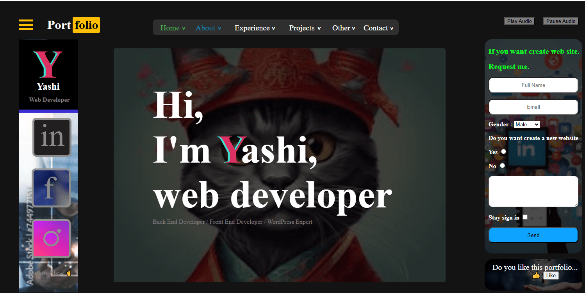
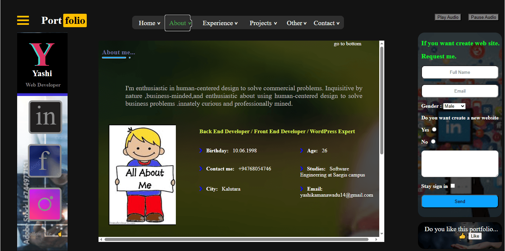
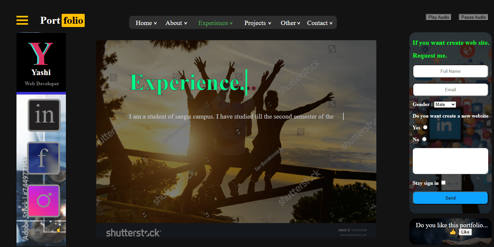
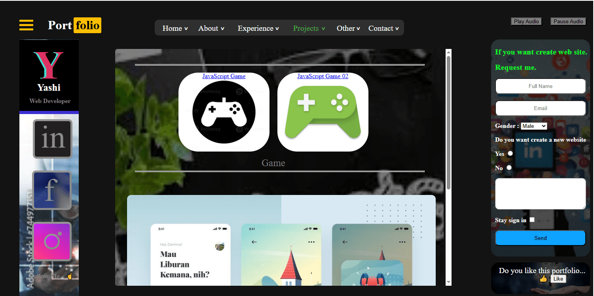
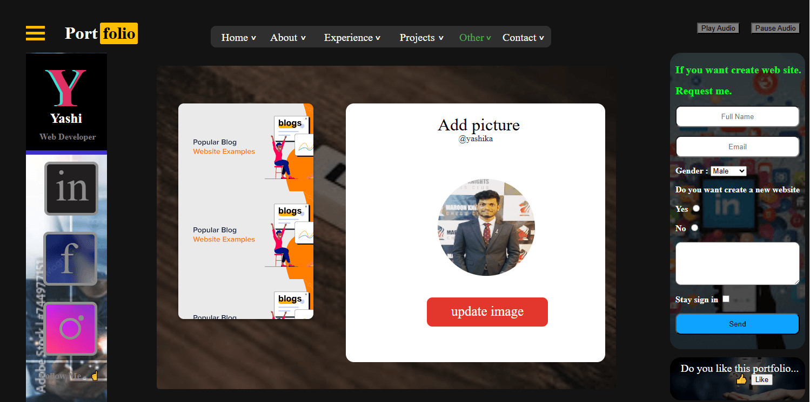
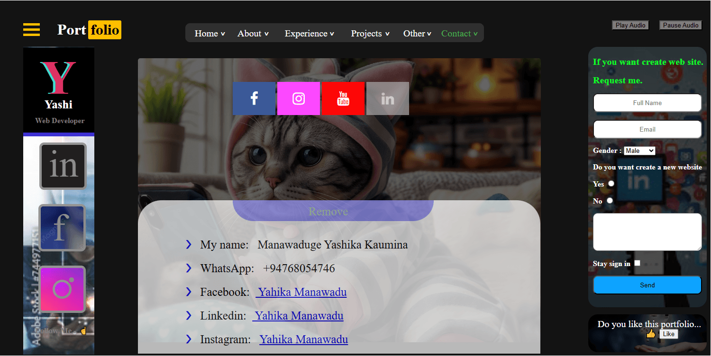

# 🚀 Yashika Kaumina - Interactive Portfolio Mockup

> A fully functional interactive website mockup built from scratch using pure HTML, CSS, and Vanilla JavaScript.


---

## ✨ Features

- 🎵 **Audio Player** - Play/Pause background music
- 📱 **Dynamic Tab Switching** - Smooth navigation between sections (Home, About, Experience, Projects, Other, Contact)
- 📊 **Skill Progress Bars** - Visual representation of technical skills (HTML, CSS, JavaScript, PHP)
- 🖼️ **Real-time Image Uploader** - Upload and preview profile pictures instantly
- ❤️ **Interactive Like Button** - Toggle like/dislike with live counter
- 📧 **Contact Form** - Functional form with Formspree integration
- 🎮 **Mini Games** - Embedded JavaScript games (Number Guessing Game & Shape Click Game)
- 📱 **Fully Responsive** - Works on all devices

---

## 🛠️ Technologies Used

| Technology | Purpose |
|------------|---------|
| **HTML5** | Structure & Content |
| **CSS3** | Styling, Animations, Responsive Design |
| **JavaScript (Vanilla)** | Interactivity, DOM Manipulation, Event Handling |
| **Font Awesome** | Icons |
| **Formspree** | Contact Form Backend |

---

## 📁 Project Structure


---

## 🚀 Live Demo

🔗 **[View Live Demo](https://Yashika-Kaumina.github.io)** 

> ⚠️ **Note:** Replace the link above with your actual GitHub Pages URL if different.

---
## 📸 Screenshots

| Home Section | About Section |
|--------------|---------------|
|  |  |

| Experience Section | Projects Section |
|--------------------|------------------|
|  |  |

| Contact Section | Mobile View |
|-----------------|-------------|
|  |  |

*(Replace with actual screenshot file names if you have them)*

---

## 💻 How to Run Locally

1. **Clone the repository**
   ```bash
   git clone https://github.com/Yashika-Kaumina/Yashika.github.io.git


   
